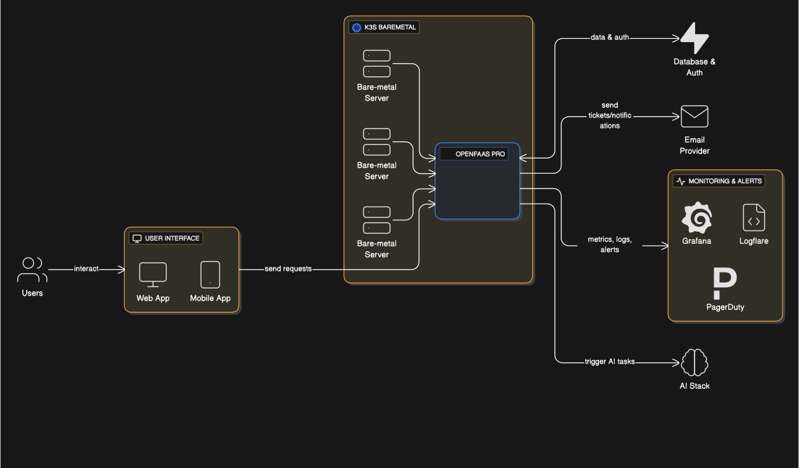
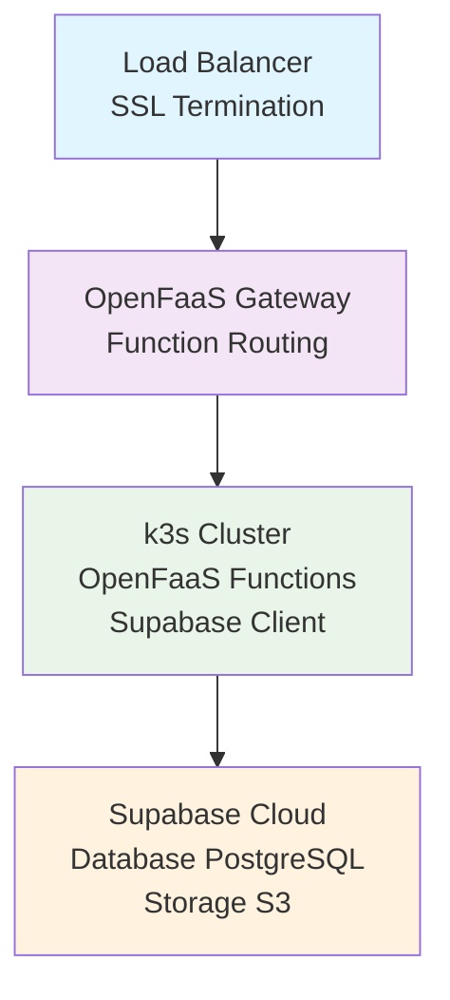
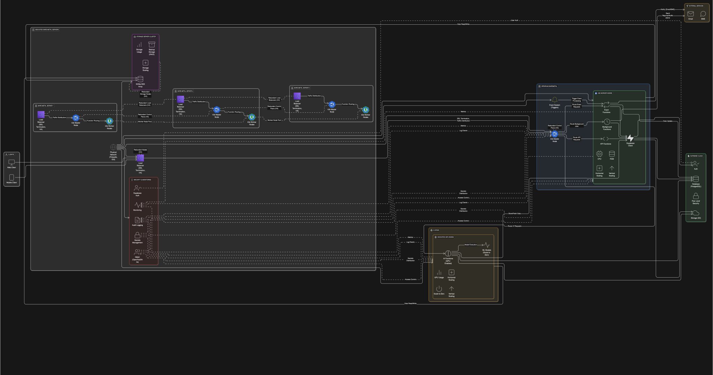

# OpenFaaS Architecture Overview

System architecture for a modern serverless platform built on OpenFaaS Pro, k3s, and Supabase.

## Table of Contents

- [Executive Summary](#executive-summary)
- [System Architecture](#system-architecture)
- [Components](#components)
- [Data Flow](#data-flow)
- [Security Architecture](#security-architecture)
- [Deployment Architecture](#deployment-architecture)
- [References](#references)

## Executive Summary

**Platform**: Modern serverless platform built on OpenFaaS Pro with k3s and Supabase
**Architecture**: Serverless functions with managed backend services
**Infrastructure**: Bare metal dedicated servers with lightweight Kubernetes

## System Architecture

*For a detailed technical view with server specifications and infrastructure components, see [Technical Architecture](diagrams/02-technical-architecture.svg).*

Our serverless platform uses a modern architecture deployed on dedicated physical servers with the following key components:

- **k3s**: Lightweight Kubernetes distribution for container orchestration
- **OpenFaaS Pro**: Serverless function platform with advanced features
- **Supabase**: Backend-as-a-Service for database, authentication, and storage

## Components

### Core Infrastructure
- **k3s (Kubernetes)** – Lightweight Kubernetes distribution, runs on our dedicated server.
- **OpenFaaS Pro** – Function gateway, autoscaling, GitOps integration, RBAC, and secrets.
- **Supabase** – Handles database, authentication, and storage.

### Function Categories
- **API Functions** – REST API endpoints for business logic
- **Event Processing** – Handle business events, AI responses, and updates
- **AI Functions** – Recommendation engine, data analysis, machine learning
- **Integration Functions** – Connect with external services, APIs, and third-party systems
- **Background Jobs** – Data processing, reporting, maintenance tasks

## Data Flow

### Request Flow
1. **Client Request** → Load Balancer
2. **Load Balancer** → OpenFaaS Gateway
3. **OpenFaaS Gateway** → Function (API/Event/Services/AI)
4. **Function** → Supabase (Database/Auth/Storage)
5. **Response** → Client

### Event-Driven Flow
1. **Event Trigger** → OpenFaaS Event System
2. **Event System** → Function (Event Processing)
3. **Function** → Supabase (Data Update)
4. **Function** → External Services (AI responses, Email, etc.)

## Security Architecture

### Authentication & Authorization
- **Supabase Auth** – User authentication and session management
- **OpenFaaS RBAC** – Function-level access control
- **k3s RBAC** – Infrastructure-level access control
- **Secrets Management** – Secure storage of API keys and credentials

### Network Security
- **Load Balancer** – SSL termination and traffic distribution
- **OpenFaaS Gateway** – Function routing and security
- **k3s Network Policies** – Pod-to-pod communication control
- **Supabase Row Level Security** – Database-level access control

## Deployment Architecture

### Infrastructure Layers

### Detailed Technical Architecture

*Click [here](diagrams/02-technical-architecture.svg) to view full size diagram*

### Function Deployment
- **API Functions** – Deployed as HTTP-triggered functions
- **Event Functions** – Deployed as event-driven functions
- **Serverless Functions** – Deployed with GPU profiles and scale-to-zero
- **Background Functions** – Deployed with cron triggers

## Scalability Considerations

### Horizontal Scaling
- **k3s Worker Nodes** – Add nodes for increased capacity
- **OpenFaaS Functions** – Auto-scale based on demand
- **Load Balancer** – Distribute traffic across nodes

### Vertical Scaling
- **Server Resources** – Increase CPU/RAM as needed
- **Hardware Resources** – Add bare-metal nodes for serverless workloads
- **Storage Scaling** – Expand storage capacity

## Monitoring & Observability

### Metrics Collection
- **OpenFaaS Metrics** – Function performance and scaling
- **k3s Metrics** – Cluster health and resource usage
- **Supabase Metrics** – Database performance and usage
- **Custom Metrics** – Business-specific KPIs

### Logging
- **Function Logs** – Application-level logging
- **Infrastructure Logs** – System and security logs
- **Audit Logs** – Compliance and security auditing

## Disaster Recovery

### Backup Strategy
- **Function Code** – Version controlled in Git
- **Configuration** – Stored in GitOps repositories
- **Database** – Automated Supabase backups
- **Storage** – Redundant storage with versioning

### Recovery Procedures
- **Function Recovery** – Redeploy from Git repositories
- **Infrastructure Recovery** – Rebuild from configuration
- **Data Recovery** – Restore from Supabase backups

## References

- [OpenFaaS Pro Documentation](https://docs.openfaas.com/openfaas-pro/introduction/)
- [k3s Documentation](https://docs.k3s.io/)
- [Supabase Documentation](https://supabase.com/docs)
- [Executive Architecture Diagram](diagrams/01-overview-architecture.svg)

---

*This architecture is designed for scalability, security, and maintainability. Adjust components based on specific requirements and constraints.*
