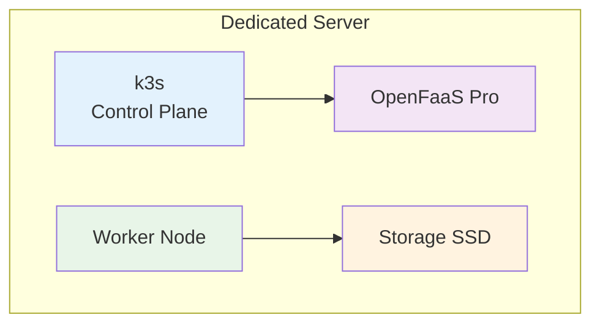
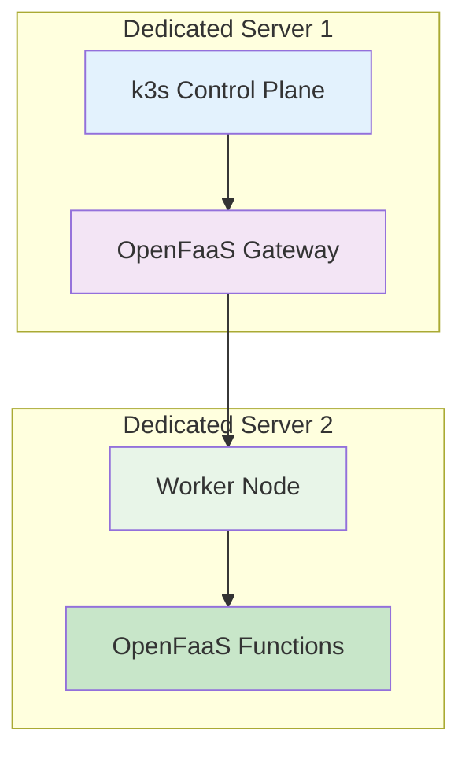
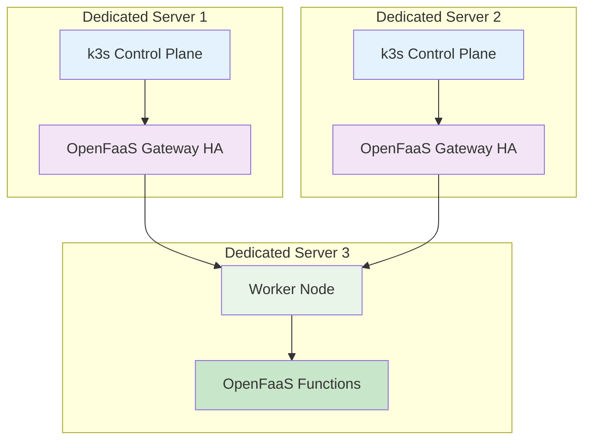

# OpenFaaS Scaling Strategy: Bare Metal with k3s

Scaling plan for OpenFaaS Pro on dedicated bare metal infrastructure using k3s.

## Table of Contents

- [Executive Summary](#executive-summary)
- [Initial Setup](#initial-setup)
- [Scaling Phases](#scaling-phases)
- [Infrastructure Requirements](#infrastructure-requirements)
- [Cost Analysis](#cost-analysis)
- [Implementation Steps](#implementation-steps)
- [Monitoring & Optimization](#monitoring--optimization)
- [References](#references)

## Executive Summary

**Strategy**: Start with single-node k3s on dedicated server, scale horizontally by adding worker nodes as needed.
**Platform**: OpenFaaS Pro manages function scaling across nodes automatically.
**Infrastructure**: Bare metal dedicated servers for predictable performance and cost control.

## Initial Setup

### Single Node Architecture

### Minimum Requirements
- **CPU**: 4 cores minimum (8+ recommended)
- **RAM**: 16GB minimum (32GB recommended)
- **Storage**: 256GB SSD minimum (512GB+ recommended)
- **Network**: 1Gbps minimum (10Gbps recommended)

## Scaling Phases

### Phase 1: Single Node (Development/Testing)
- **Infrastructure**: 1 dedicated server
- **k3s**: Single-node cluster
- **OpenFaaS Pro**: Basic deployment
- **Capacity**: Up to 50 concurrent functions
- **Use Case**: Development, testing, low-traffic production

### Phase 2: Multi-Node Cluster (Production)

- **Infrastructure**: 2+ dedicated servers
- **k3s**: Multi-node cluster with control plane + workers
- **OpenFaaS Pro**: Distributed deployment
- **Capacity**: Up to 200+ concurrent functions
- **Use Case**: Production workloads, high availability

### Phase 3: High Availability Cluster (Enterprise)

- **Infrastructure**: 3+ dedicated servers
- **k3s**: High availability control plane + multiple workers
- **OpenFaaS Pro**: HA deployment with load balancing
- **Capacity**: 500+ concurrent functions
- **Use Case**: Enterprise workloads, maximum availability

## Infrastructure Requirements

### Server Specifications

| Phase | Servers | CPU | RAM | Storage | Network |
|-------|---------|-----|-----|---------|---------|
| **Phase 1** | 1 | 8 cores | 32GB | 512GB SSD | 1Gbps |
| **Phase 2** | 2 | 8 cores each | 32GB each | 512GB SSD each | 1Gbps |
| **Phase 3** | 3+ | 8+ cores each | 32GB+ each | 512GB+ SSD each | 10Gbps |

### Network Requirements
- **Internal**: 1Gbps minimum between nodes
- **External**: 1Gbps minimum internet connection
- **Load Balancer**: Required for Phase 2+ (HAProxy, nginx, or cloud load balancer)

### Storage Requirements
- **Local Storage**: SSD for OS and applications
- **Persistent Storage**: NFS, Ceph, or cloud storage for function data
- **Backup Storage**: Separate storage for backups and disaster recovery

## Cost Analysis

### Monthly Costs (Estimated)

| Phase | Infrastructure | OpenFaaS Pro | Total |
|-------|----------------|--------------|-------|
| **Phase 1** | $200-400 | $1,200 | $1,400-1,600 |
| **Phase 2** | $400-800 | $1,200 | $1,600-2,000 |
| **Phase 3** | $600-1,200 | $1,200 | $1,800-2,400 |

### Cost Optimization Factors
- **Scale to Zero**: OpenFaaS Pro reduces idle function costs
- **Resource Optimization**: Monitor and adjust resource allocation
- **Bulk Purchasing**: Negotiate better rates for multiple servers

## Implementation Steps

### Phase 1: Single Node Setup
1. **Provision dedicated server** with minimum specifications
2. **Install k3s** using official installation script
3. **Deploy OpenFaaS Pro** using Helm charts
4. **Configure basic monitoring** (Prometheus, Grafana)
5. **Test function deployment** and scaling

### Phase 2: Multi-Node Expansion
1. **Provision additional server** for worker node
2. **Join worker to k3s cluster** using join token
3. **Migrate OpenFaaS functions** to worker nodes
4. **Configure load balancer** for high availability
5. **Update monitoring** for multi-node setup

### Phase 3: High Availability
1. **Provision control plane server** for HA
2. **Configure k3s HA control plane** with external database
3. **Deploy OpenFaaS Pro in HA mode**
4. **Configure automated failover** and load balancing
5. **Implement comprehensive monitoring** and alerting

## Monitoring & Optimization

### Key Metrics to Monitor
- **Function execution time** and throughput
- **Resource utilization** (CPU, RAM, storage)
- **Network performance** and latency
- **Error rates** and function failures
- **Cost per function execution**

### Optimization Strategies
- **Function sizing**: Right-size CPU and memory limits
- **Caching**: Implement function result caching
- **Connection pooling**: Optimize database connections
- **Resource limits**: Set appropriate resource constraints

### Scaling Triggers
- **CPU utilization** > 70% consistently
- **Memory usage** > 80% consistently
- **Function queue depth** > 10 requests
- **Response time** > 2 seconds average

## References

- [k3s Documentation](https://docs.k3s.io/)
- [OpenFaaS Pro Scaling](https://docs.openfaas.com/openfaas-pro/scale-to-zero/)
- [Kubernetes Cluster Scaling](https://kubernetes.io/docs/concepts/architecture/nodes/)

---

*This scaling strategy is based on OpenFaaS Pro capabilities and k3s best practices. Adjust specifications based on your specific workload requirements.*
